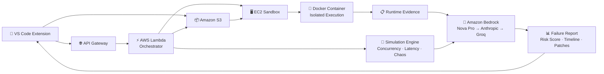

<p align="center">
  
</p>

<h1 align="center">🛡️ BlastShield</h1>

<p align="center">
  <strong>Shield your code from production failures before they happen.</strong><br/>
  Simulate concurrent traffic, inject chaos, and generate AI-backed postmortem reports — without leaving VS Code.
</p>

<p align="center">
  <a href="https://marketplace.visualstudio.com/items?itemName=blastshield.blastshield">
    
  </a>
</p>

<p align="center">
  <a href="https://github.com/Deepesh1024/blastshield-prodsim"></a>
  <a href="https://github.com/Deepesh1024/blastshield-extension"></a>
  
  
  
  
</p>

<br/>

<table align="center">
  <tr>
    <th>🔗 Source Repository</th>
    <th>Description</th>
  </tr>
  <tr>
    <td><a href="https://github.com/Deepesh1024/blastshield-prodsim"><b>📡 blastshield-prodsim</b></a></td>
    <td>Backend — Lambda orchestrator, EC2 sandbox server, AI analysis engine</td>
  </tr>
  <tr>
    <td><a href="https://github.com/Deepesh1024/blastshield-extension"><b>🧩 blastshield-extension</b></a></td>
    <td>VS Code Extension — Observability dashboard, failure maps, incident replay</td>
  </tr>
</table>

---

## Overview

BlastShield is a **production failure simulator** that stress-tests developer projects under realistic conditions before deployment.

Instead of static analysis, it runs deterministic simulation drills — concurrency races, latency injections, chaos faults, and edge-case inputs — against the developer's actual code. The results are sent to an AI analysis engine (Amazon Bedrock) which generates a structured postmortem report explaining what failed, why it would fail in production, and how to fix it.

Developers receive:
- A **production risk score** (0–100)
- A **failure timeline** with causal event narrative
- A **blast radius assessment** across affected modules
- **AI-generated patches** with before/after code diffs

All from a single command inside VS Code.

> If static analysis is a spell-checker, BlastShield is a crash test dummy for your production system.

---

## Core Features

| Feature | Description |
|---|---|
| **Production Simulation** | Concurrency, latency injection, chaos engineering, and edge-case testing |
| **Multi-File Project Analysis** | Analyses entire Python codebases — not just single scripts |
| **Endpoint Load Testing** | Automatically detects API routes and simulates concurrent HTTP traffic |
| **AI Outage Intelligence** | Generates failure timelines, root cause analysis, and blast radius via Amazon Bedrock |
| **Production Risk Score** | Deterministic 0–100 score quantifying deployment readiness |
| **VS Code Integration** | One-command simulation from the IDE — results rendered in a full-screen dashboard |
| **Offline Demo Mode** | Realistic mock data mode for environments without backend access |

---

## Architecture

```
VS Code Extension → API Gateway → AWS Lambda → S3 + EC2 Sandbox → Amazon Bedrock → Report
```



See [design.md](./design.md) for the complete system architecture, component breakdown, data flow, and security model.

---

## Tech Stack

| Layer | Technologies |
|---|---|
| **Extension** | TypeScript, React 18, React Flow, Chart.js, Vite, esbuild |
| **Backend API** | Python 3.13, FastAPI, Mangum, AWS Lambda |
| **Sandbox** | Docker, EC2 (Amazon Linux 2023), Groq AI |
| **AI Models** | Amazon Nova Pro, Anthropic Prompt Router, Groq GPT-OSS |
| **Storage** | Amazon S3 |
| **Infrastructure** | AWS Lambda, Amazon API Gateway, Amazon EC2 |

---

## Quick Start

### Download the Extension

Install BlastShield directly from the [VS Code Marketplace](https://marketplace.visualstudio.com/items?itemName=blastshield.blastshield).

### Run a Simulation

1. Open a Python project workspace in VS Code
2. Open the Command Palette (`Ctrl+Shift+P` / `Cmd+Shift+P`)
3. Run **`BlastShield: Run Production Simulation`**
4. The observability dashboard opens with full results

### Backend — Local Development

```bash
# Clone the backend
git clone https://github.com/Deepesh1024/blastshield-prodsim.git
cd blastshield-prodsim

# Setup Python environment
python3 -m venv venv && source venv/bin/activate
pip install -r requirements.txt

# Configure environment variables
cp .env.example .env   # Add your API keys

# Run the API server
uvicorn app.main:app --port 8000
```

### EC2 Sandbox Server

```bash
cd ec2_sandbox
pip install -r requirements.txt

# Build the sandboxed runner Docker image
docker build -t blastshield-runner .

# Run the sandbox server
export GROQ_API_KEY="your-key"
python server.py   # Runs on port 9000
```

---

## API Reference

### `POST /scan`

Accepts Python code as a JSON string or a `.zip` file upload:

```bash
# JSON payload
curl -X POST https://your-api/scan \
  -H "Content-Type: application/json" \
  -d '{"code": "from fastapi import FastAPI\napp = FastAPI()\n@app.get(\"/health\")\ndef health():\n    return {\"ok\": True}"}'

# Zip file upload
curl -X POST https://your-api/scan \
  -F "file=@project.zip"
```

<details>
<summary><strong>Response Schema</strong></summary>

```json
{
  "scan_id": "uuid",
  "overall_score": 45,
  "simulation_results": {
    "drills": {
      "concurrency": [],
      "latency": [],
      "chaos": []
    },
    "edge_cases": [],
    "curl_results": []
  },
  "deployment_validation": {
    "deployment_status": "success|failure|timeout",
    "runtime_errors": [],
    "logs": "...",
    "container_exit_code": 0
  },
  "ai_analysis": {
    "timeline": "...",
    "outage_scenario": "...",
    "blast_radius": "...",
    "patches": []
  },
  "s3_artifact": {
    "bucket": "blastshield-artifacts",
    "key": "{scan_id}.zip"
  }
}
```

</details>

### `GET /health`

```bash
curl https://your-api/health
# → {"status": "ok"}
```

---

## Environment Variables

| Variable | Description |
|---|---|
| `AWS_BEARER_TOKEN_BEDROCK` | AWS Bedrock authentication token |
| `GROQ_API_KEY` | Groq API key (sandbox AI + cascade fallback) |
| `AWS_REGION` | AWS region (default: `us-east-1`) |
| `S3_BUCKET` | S3 bucket for scan artefacts (default: `blastshield-artifacts`) |
| `EC2_SANDBOX_URL` | EC2 sandbox server URL (default: `http://localhost:9000`) |

---

## Security

- **Sandboxed execution** — User code runs inside Docker with a read-only filesystem and `--network=none`
- **Ephemeral containers** — Destroyed after every run; no persistent state between scans
- **IAM least privilege** — Lambda and EC2 roles hold only the minimum required S3 and Bedrock permissions
- **CSP-restricted webviews** — Extension UI enforces Content Security Policy within the VS Code sandbox

---

## Documentation

| Document | Description |
|---|---|
| [requirements.md](./requirements.md) | Functional and non-functional requirements specification |
| [design.md](./design.md) | System architecture, component breakdown, data flow, and design decisions |

---

## Impact

BlastShield shifts production failure discovery from post-incident to pre-deployment. Developers detect concurrency races, cascading latency, and runtime exceptions before their code ever touches a live server — saving debugging hours and preventing costly outages.

---

<p align="center">
  <strong>Built with 🔥 by <a href="https://github.com/Deepesh1024">Deepesh Kumar Jha</a></strong><br/>
  <sub>Production breaks shouldn't be discovered in production.</sub>
</p>
