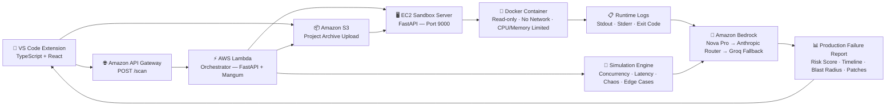

# Technical Design Document: BlastShield

## System Architecture

BlastShield is a distributed, serverless production failure simulation platform built natively on AWS. The architecture separates concerns across three deployment boundaries: a VS Code Extension for developer interaction, an AWS Lambda orchestrator for simulation logic, and an EC2-hosted Docker sandbox for isolated runtime validation.

**Core data flow:**

```
VS Code Extension → API Gateway → AWS Lambda → S3 + EC2 Sandbox → Amazon Bedrock → Production Failure Report
```

---

## Architecture Diagram



---

## Component Breakdown

### VS Code Extension

**Technology**: TypeScript · React 18 · React Flow · Chart.js · Vite · adm-zip

The developer-facing interface. Available publicly on the [VS Code Marketplace](https://marketplace.visualstudio.com/items?itemName=blastshield.blastshield).

**Responsibilities:**
- Expose `BlastShield: Run Production Simulation` via the Command Palette
- Compress the active workspace using `adm-zip` (filters: `node_modules`, `.git`, `__pycache__`, build artefacts)
- Send `multipart/form-data` POST to the backend with retry logic (3 attempts, exponential backoff)
- Transform the API response into a flat UI-compatible schema
- Render a full-screen observability dashboard inside a CSP-restricted Webview

**Dashboard components:**
| Component | Description |
|---|---|
| Risk Score | 0–100 score with severity classification (LOW / MEDIUM / HIGH / CRITICAL) |
| Failure Propagation Map | Interactive React Flow graph showing error cascade across modules |
| Incident Replay Timeline | Step-by-step playback of the simulated failure sequence |
| Evidence Metrics | Counters for lost updates, timeouts, and unhandled exceptions |
| Root Cause Report | AI-generated explanation with technical detail |
| Patch Viewer | Diff-highlighted before/after code patches |
| What-If Simulation | Adjust traffic, latency, and chaos parameters to re-run scenarios |

---

### Amazon S3

**Service**: Amazon S3 (`blastshield-artifacts` bucket)

S3 acts as the artifact bridge between Lambda and the EC2 sandbox. After extraction, Lambda uploads the project archive to S3. The EC2 sandbox then downloads it directly — decoupling upload from execution and avoiding payload size constraints across service boundaries.

**Artifact lifecycle:**
```
Lambda uploads: s3://blastshield-artifacts/{scan_id}.zip
EC2 downloads:  s3://blastshield-artifacts/{scan_id}.zip
Cleanup:        /tmp/blastshield/{scan_id}/ deleted post-execution
```

---

### Amazon API Gateway

**Type**: HTTP API (REST pass-through)

Provides the secure, managed HTTP interface for simulation requests. Accepts `multipart/form-data` zip uploads and `application/json` code payloads. Routes all traffic to the Lambda orchestrator.

- CORS enabled for VS Code extension origin
- Configurable throttling (1,000 req/s)
- CloudWatch access logging enabled

---

### AWS Lambda — Orchestrator

**Technology**: Python 3.13 · FastAPI · Mangum ASGI adapter

The central orchestration layer. Receives scan requests, coordinates all simulation drills, calls the EC2 sandbox, invokes Bedrock AI, and assembles the final report.

**Execution pipeline (POST `/scan`):**

```
1. Extract project files from zip or JSON payload
2. Detect API endpoints (FastAPI / Flask route definitions)
3. Build module call graph
4. Run simulation drills in parallel:
   ├── Concurrency drill  (10–100 concurrent request simulation)
   ├── Latency injection  (50ms–5000ms delay injection)
   ├── Chaos engineering  (random fault injection)
   └── Edge case testing  (null / boundary / malformed inputs)
5. Upload project archive to S3
6. POST to EC2 sandbox: /run-sandbox → retrieve runtime validation result
7. Invoke Bedrock AI cascade → generate postmortem report
8. Calculate risk score (0–100, deterministic formula)
9. Return structured ScanResult JSON to extension
```

**Deployment:**
- Runtime: Python 3.13
- Memory: 1,024 MB
- Timeout: 25 seconds
- Trigger: API Gateway HTTP API
- Adapter: Mangum (ASGI → Lambda event bridge)

---

### Simulation Engine

**Location**: `app/core/` within the Lambda package

The simulation engine runs entirely within Lambda, producing structured evidence before any AI model is invoked. This ensures reports are grounded in deterministic drill results, not AI inference.

**Drills:**

| Module | Drill Type | What It Detects |
|---|---|---|
| `drills.py` | Concurrency | Race conditions, shared state mutations, missing locks |
| `drills.py` | Latency injection | Timeout misconfigurations, cascading failures |
| `drills.py` | Chaos engineering | Exception handling gaps, missing retry logic |
| `edge_cases.py` | Boundary testing | Null inputs, type errors, empty collection handling |
| `curl_runner.py` | Load simulation | Endpoint throughput, error rates, performance bottlenecks |

**Risk score formula:**

```python
score = 100
for issue in concurrency_issues:
    score -= 15 if issue["severity"] == "high" else 8 if issue["severity"] == "medium" else 3
for issue in latency_issues:
    score -= 10 if issue["severity"] == "high" else 3
for issue in chaos_issues:
    score -= 12 if issue["severity"] == "critical" else 8 if issue["severity"] == "high" else 3
for ec in edge_cases:
    score -= 5 if ec["result"] == "crashed" else 2 if ec["result"] == "failed" else 0
for cr in load_results:
    score -= 10 if cr["verdict"] == "critical" else 5 if cr["verdict"] == "degraded" else 0
if deployment["status"] == "failure":
    score -= 20
score -= min(len(deployment["runtime_errors"]) * 5, 25)
return max(0, min(100, score))
```

---

### EC2 Sandbox

**Technology**: Python 3.13 · FastAPI · Docker SDK · Amazon Linux 2023 · `t3.small`

The EC2 sandbox provides isolated runtime validation. EC2 is used instead of Lambda because nested Docker execution is not supported within Lambda.

**Execution flow (POST `/run-sandbox`):**

```
1. Download project archive from S3 → /tmp/blastshield/{scan_id}/
2. Spawn Docker container with security constraints
3. runner.py executes user code inside container
4. Capture stdout, stderr, exit code, exceptions
5. Groq AI analyzes runtime errors (if any)
6. Return structured deployment result to Lambda
7. Cleanup: delete /tmp/blastshield/{scan_id}/
```

**Docker security constraints:**

| Control | Value |
|---|---|
| CPU | `--cpus=1` |
| Memory | `--memory=512m` |
| Process limit | `--pids-limit=64` |
| Network | `--network=none` |
| Filesystem | `--read-only` + `--tmpfs /tmp:size=64m` |
| Lifecycle | `--rm` (ephemeral) |
| Timeout | Configurable (default 10s) |

---

### Amazon Bedrock — AI Analysis

**Primary model**: Amazon Nova Pro
**Fallback cascade**: Anthropic Prompt Router → Groq GPT-OSS → Static response

Bedrock receives the complete simulation evidence package (drill results, deployment validation, call graph) and generates a structured postmortem report.

**Prompt inputs:**
- All drill findings with severity classifications
- EC2 deployment result (status, runtime errors, logs)
- Detected endpoint and module structure

**Report outputs:**
- Failure timeline with causal event narrative
- Root cause analysis with technical explanation
- Blast radius assessment (affected modules / services)
- Remediation patches with code diffs
- Executive summary for non-technical stakeholders

**Cascade rationale:**
- Amazon Nova Pro provides highest-quality reasoning when available
- Anthropic Router offers strong fallback within the same Bedrock API
- Groq GPT-OSS provides fast, cost-effective final fallback
- Static response ensures the system never returns an empty result

---

## Data Flow

```
Developer → VS Code Extension
         → Workspace compressed to .zip (adm-zip)
         → POST /scan → API Gateway → Lambda

Lambda   → Extract files → Detect endpoints → Build call graph
         → Run simulation drills (concurrency / latency / chaos / edge cases)
         → Upload .zip to S3
         → POST /run-sandbox → EC2 Sandbox

EC2      → Download .zip from S3
         → Spawn Docker container (isolated)
         → Execute user code → Capture logs + errors
         → Groq analyzes runtime errors
         → Return deployment result → Lambda

Lambda   → Invoke Amazon Bedrock (Nova Pro cascade)
         → Build AI postmortem report
         → Calculate deterministic risk score (0–100)
         → Return structured ScanResult JSON

Extension → Transform response → Render observability dashboard
```

---

## Design Decisions

### Why AWS Lambda?

Serverless orchestration enables the simulation pipeline to scale elastically from zero without managing persistent infrastructure. Lambda auto-scales to 1,000+ concurrent invocations, and the pay-per-execution model eliminates idle costs entirely.

### Why Amazon S3?

S3 serves as the artifact bridge between Lambda and EC2. Passing large zip payloads directly between services would be constrained by HTTP body limits. S3 decouples upload from execution and provides a durable audit trail of all scanned projects.

### Why EC2 for the Sandbox?

AWS Lambda does not support spawning Docker containers at runtime. EC2 provides the full Docker daemon required for isolated, resource-constrained code execution. A `t3.small` instance is sufficient for the sandbox workload and keeps fixed costs minimal.

### Why Amazon Bedrock?

Bedrock provides access to Amazon Nova Pro, a high-capability reasoning model, natively within the AWS ecosystem — eliminating cross-cloud authentication complexity. The multi-model cascade (`Nova Pro → Anthropic → Groq → Static`) ensures the system never silently fails due to a single model's unavailability.

### Why a Multi-Model AI Cascade?

A single-model dependency creates a reliability risk. The cascade strategy ensures:
1. Best-quality results when top-tier models are available
2. Graceful degradation to capable fallbacks on transient failures
3. A static safety net that guarantees the system always returns a usable report

---

## Reliability Considerations

- **Sandbox isolation**: User code never executes on Lambda or the host filesystem
- **Deterministic drills first**: Simulation evidence is generated before AI is invoked, so reports always have supporting data regardless of AI availability
- **4-tier AI cascade**: Prevents silent failures on any single model
- **Extension retry logic**: 3 attempts with exponential backoff on transient network errors
- **Offline demo mode**: Extension remains usable without backend connectivity
- **Ephemeral containers**: Each sandbox run is fully stateless with automatic cleanup

---

## Scalability

| Layer | Scaling Mechanism |
|---|---|
| API Gateway | Managed, auto-scales with traffic |
| Lambda | Auto-scales to 1,000 concurrent executions |
| S3 | Unlimited capacity; 3,500 PUT / 5,500 GET requests per second per prefix |
| EC2 Sandbox | Horizontal scaling via additional instances behind a load balancer |
| AI Cascade | Stateless; parallel invocations naturally distributed by Bedrock |

---

## Security Architecture

### IAM Least Privilege

**Lambda execution role:**
```json
{
  "Effect": "Allow",
  "Action": ["bedrock:InvokeModel", "s3:PutObject", "s3:GetObject"],
  "Resource": ["arn:aws:bedrock:*::*", "arn:aws:s3:::blastshield-artifacts/*"]
}
```

**EC2 instance role:**
```json
{
  "Effect": "Allow",
  "Action": ["s3:GetObject"],
  "Resource": ["arn:aws:s3:::blastshield-artifacts/*"]
}
```

### Extension Security
- Webview runs in a sandboxed `iframe` with Content Security Policy
- No `eval()` or dynamic code execution in extension host
- Credentials loaded from environment variables (never committed)
- All workspace data sent over HTTPS to API Gateway

### Sandbox Security
- Docker containers run with `--read-only` filesystem
- `--network=none` blocks all external communication
- Resource limits prevent denial-of-service via CPU or memory exhaustion
- Containers destroyed immediately after execution (`--rm`)
