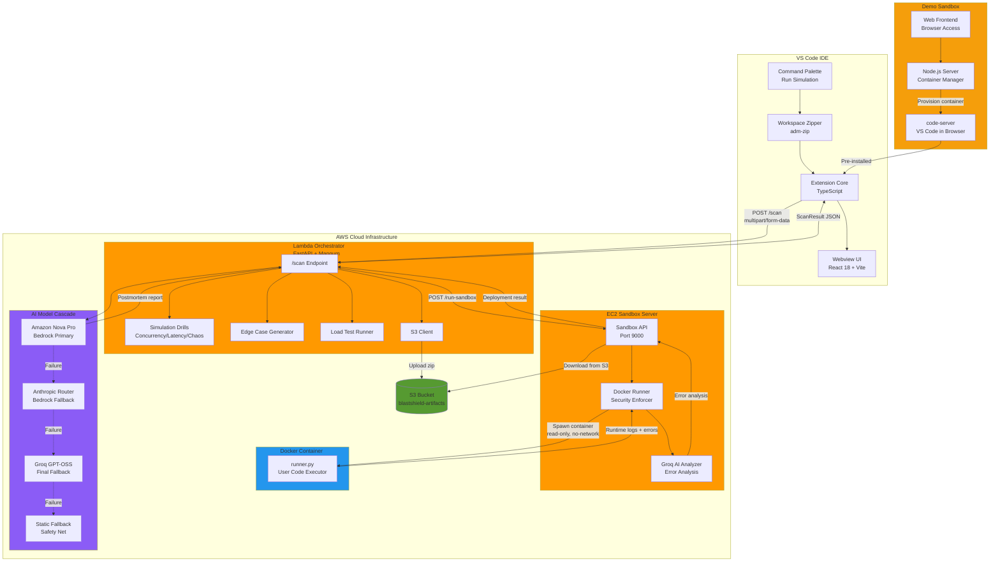

# System Design

## System Overview

BlastShield is a distributed production failure simulation platform architected across three primary components:

1. **blastshield-agent** (Backend): Serverless AWS Lambda orchestrator with EC2 sandbox execution
2. **blastshield-extension** (Frontend): VS Code extension with React-based observability dashboard
3. **demo-sandbox** (Demo Infrastructure): Containerized code-server environments for browser-based demos

The system follows a **deterministic-first, AI-enhanced** architecture where static analysis and rule-based drills provide the foundation, with optional AI models adding explanations and patch generation.

## High-Level Architecture



## Component Breakdown

### 1. VS Code Extension (blastshield-extension)

**Technology Stack**: TypeScript, React 18, React Flow, Chart.js, Vite, esbuild, adm-zip

**Architecture**:
```
Extension Host Process (Node.js)
├── extension.ts (Main entry point)
├── api/scanClient.ts (HTTP client with retry logic)
├── zip/workspaceZipper.ts (Workspace compression)
├── webview/BlastShieldPanel.ts (Webview provider)
└── responseTransformer.ts (API response adapter)

Webview Process (Isolated iframe with CSP)
├── App.tsx (Main React component)
├── components/
│   ├── RiskScore.tsx (0-100 score display)
│   ├── SeverityBanner.tsx (LOW/MEDIUM/HIGH/CRITICAL)
│   ├── EvidenceMetrics.tsx (Counters for failures)
│   ├── PropagationGraph.tsx (React Flow failure map)
│   ├── TimelineReplay.tsx (Step-by-step playback)
│   ├── NetworkGraph.tsx (Chart.js traffic visualization)
│   ├── LogsViewer.tsx (Severity-filtered logs)
│   ├── RootCause.tsx (AI analysis display)
│   ├── PatchViewer.tsx (Diff highlighting)
│   ├── PostmortemReport.tsx (Incident report)
│   └── WhatIfSimulation.tsx (Scenario re-testing)
└── types.ts (TypeScript interfaces)
```

**Key Responsibilities**:
- Trigger simulations via Command Palette
- Zip workspace (exclude node_modules, .git, build artifacts)
- Send multipart/form-data POST to backend
- Handle retry logic (3 attempts, exponential backoff)
- Transform nested API responses to flat UI schema
- Render full-screen observability dashboard
- Support offline demo mode with mock data
- Enable "What-If" scenario testing

**Communication Flow**:
1. User executes `BlastShield: Run Production Simulation`
2. Extension zips workspace using adm-zip (filters by ignore rules)
3. Sends POST to `${BLASTSHIELD_API_URL}/scan` with zip buffer
4. Polls or waits for response (timeout: 120s)
5. Transforms API response to UI-compatible format
6. Posts message to webview with scan results
7. React app renders interactive dashboard

**Security**:
- Webview runs in isolated iframe with Content Security Policy
- No direct filesystem access from webview
- Message passing via VS Code API only
- Environment variables loaded from .env file

---

### 2. Backend Lambda Orchestrator (blastshield-agent)

**Technology Stack**: Python 3.13, FastAPI, Mangum, Boto3, httpx, aiofiles

**Architecture**:
```
Lambda Function (Serverless)
├── handler.py (Mangum ASGI adapter)
├── app/
│   ├── main.py (FastAPI app initialization)
│   ├── api/
│   │   └── scan.py (POST /scan endpoint)
│   ├── core/
│   │   ├── extract.py (Zip/code extraction, endpoint detection)
│   │   ├── drills.py (Concurrency/latency/chaos simulations)
│   │   ├── edge_cases.py (Boundary value testing)
│   │   ├── curl_runner.py (Load test simulation)
│   │   ├── call_graph.py (Module interaction mapping)
│   │   ├── s3_storage.py (Artifact upload to S3)
│   │   └── ec2_client.py (Sandbox HTTP client)
│   └── ai/
│       ├── bedrock.py (Multi-model AI cascade)
│       └── prompt.py (Prompt engineering)
└── serverless.yml (Deployment configuration)
```

**Execution Pipeline** (POST /scan):

1. **Input Extraction** (extract.py)
   - Accept JSON `{"code": "..."}` or multipart zip file
   - Parse Python files, detect FastAPI/Flask endpoints
   - Extract route definitions, async functions, database calls

2. **Local Simulation Drills** (drills.py)
   - **Concurrency Drill**: Simulate 10-100 concurrent requests
     - Detect race conditions, shared state mutations
     - Identify missing locks, thread-unsafe operations
   - **Latency Drill**: Inject 50ms-5000ms delays
     - Find timeout vulnerabilities, cascading failures
     - Detect missing timeout configurations
   - **Chaos Drill**: Random fault injection
     - Simulate network failures, database disconnects
     - Test exception handling, retry logic

3. **Edge Case Testing** (edge_cases.py)
   - Generate boundary inputs (null, empty, max values)
   - Test malformed data, type mismatches
   - Validate error handling for unexpected inputs

4. **Load Testing** (curl_runner.py)
   - Simulate HTTP request patterns
   - Measure response times, error rates
   - Identify performance bottlenecks

5. **S3 Artifact Upload** (s3_storage.py)
   - Convert files to zip archive
   - Upload to `s3://blastshield-artifacts/{scan_id}.zip`
   - Return S3 location for sandbox retrieval

6. **EC2 Sandbox Execution** (ec2_client.py)
   - POST to `http://{EC2_IP}:9000/run-sandbox`
   - Pass scan_id, S3 bucket/key, timeout
   - Receive deployment status, runtime errors, logs

7. **AI Analysis** (bedrock.py)
   - Build comprehensive prompt with all drill results
   - Invoke model cascade (Nova Pro → Claude → Groq → Static)
   - Generate postmortem report with:
     - Failure timeline
     - Root cause analysis
     - Blast radius assessment
     - Remediation patches

8. **Response Assembly**
   - Calculate overall risk score (0-100)
   - Build interaction map (call graph)
   - Return structured JSON with all results

**Deployment**:
- Packaged via Mangum ASGI adapter for Lambda
- Deployed to AWS Lambda (Python 3.13 runtime)
- Triggered via API Gateway HTTP API
- Environment variables: `AWS_BEARER_TOKEN_BEDROCK`, `GROQ_API_KEY`, `EC2_SANDBOX_URL`

---

### 3. EC2 Sandbox Server (blastshield-agent/ec2_sandbox)

**Technology Stack**: Python 3.13, FastAPI, Docker SDK, Boto3, Groq API

**Architecture**:
```
EC2 Instance (Amazon Linux 2023, t3.small)
├── server.py (FastAPI server on port 9000)
├── docker_runner.py (Container orchestration)
├── groq_analyzer.py (AI error analysis)
├── runner.py (Executed INSIDE container)
├── Dockerfile (Container image definition)
└── requirements.txt (Python dependencies)
```

**Execution Flow** (POST /run-sandbox):

1. **Download from S3**
   - Receive scan_id, S3 bucket/key from Lambda
   - Download zip to `/tmp/blastshield/{scan_id}/project.zip`
   - Extract to `/tmp/blastshield/{scan_id}/project/`

2. **Docker Container Spawn** (docker_runner.py)
   ```bash
   docker run --rm \
     --cpus=1 \
     --memory=512m \
     --pids-limit=64 \
     --network=none \
     --read-only \
     --tmpfs /tmp:size=64m \
     -v /path/to/project:/app:ro \
     blastshield-runner
   ```

3. **Code Execution** (runner.py inside container)
   - Attempt to import and run user code
   - Capture stdout, stderr, exceptions
   - Return structured JSON with:
     - Deployment status (success/failure/timeout)
     - Runtime errors (stack traces)
     - Logs (execution output)
     - Exit code

4. **Groq AI Analysis** (groq_analyzer.py)
   - If errors detected, send to Groq API
   - Analyze stack traces, error patterns
   - Generate human-readable explanations

5. **Response Return**
   - Merge Docker results + Groq analysis
   - Return to Lambda orchestrator
   - Cleanup: Delete `/tmp/blastshield/{scan_id}/`

**Security Controls**:
| Control | Implementation |
|---------|----------------|
| CPU Limit | `--cpus=1` |
| Memory Limit | `--memory=512m` |
| Process Limit | `--pids-limit=64` |
| Network Isolation | `--network=none` |
| Filesystem | `--read-only` + tmpfs |
| Timeout | Configurable (default 10s) |
| Ephemeral | `--rm` (auto-delete) |

**Fallback Behavior**:
- If Docker unavailable: Static syntax analysis
- If S3 download fails: Return error status
- If timeout exceeded: Kill container, return timeout status

---

### 4. Demo Sandbox (demo-sandbox)

**Technology Stack**: Node.js, Express, Docker, code-server

**Purpose**: Provide browser-based VS Code environments for zero-setup demos

**Architecture**:
```
Node.js Server (Port 3000)
├── server.js (Container orchestration)
├── Dockerfile (code-server base image)
├── projects/ (Sample projects: CacheStorm, CartRush, PayFlow, QueryBurst)
├── extensions/ (blastshield.vsix, demo-guide.vsix)
└── public/ (Static frontend assets)
```

**Workflow**:
1. User selects project from web UI
2. Server spawns Docker container:
   ```bash
   docker run -d \
     -p {9000-9100}:8080 \
     -v ./projects/{project}:/home/coder/project \
     -v ./extensions:/extensions \
     code-sandbox
   ```
3. Container auto-installs BlastShield extension
4. User accesses VS Code at `http://{host}:{port}`
5. Pre-configured workspace with sample code
6. User runs BlastShield simulation directly in browser

**Use Cases**:
- Hackathon demonstrations without local setup
- Educational workshops and tutorials
- Quick proof-of-concept testing
- Shareable demo links for stakeholders

---

## Data Flow

### End-to-End Simulation Flow

```
1. Developer triggers scan in VS Code
   ↓
2. Extension zips workspace (filters: node_modules, .git, __pycache__)
   ↓
3. POST /scan to Lambda with multipart/form-data
   ↓
4. Lambda extracts files, detects endpoints
   ↓
5. Lambda runs local drills (concurrency, latency, chaos, edge cases)
   ↓
6. Lambda uploads zip to S3
   ↓
7. Lambda calls EC2 sandbox: POST /run-sandbox
   ↓
8. EC2 downloads zip from S3
   ↓
9. EC2 spawns Docker container (read-only, no-network)
   ↓
10. Container executes user code, captures errors/logs
   ↓
11. Groq AI analyzes runtime errors (if any)
   ↓
12. EC2 returns deployment result to Lambda
   ↓
13. Lambda invokes Bedrock AI cascade:
    - Try Amazon Nova Pro
    - Fallback to Anthropic Router
    - Fallback to Groq GPT-OSS
    - Fallback to static response
   ↓
14. Lambda calculates risk score (0-100)
   ↓
15. Lambda builds interaction map (call graph)
   ↓
16. Lambda returns comprehensive JSON to extension
   ↓
17. Extension transforms response to UI schema
   ↓
18. React webview renders observability dashboard
   ↓
19. User views results, applies patches, runs "What-If" scenarios
```

### Risk Score Calculation

```python
def compute_risk_score(drills, edge_cases, curl_results, deployment):
    score = 100
    
    # Deduct for concurrency issues
    for issue in drills["concurrency"]:
        if issue["severity"] == "high": score -= 15
        elif issue["severity"] == "medium": score -= 8
        else: score -= 3
    
    # Deduct for latency issues
    for issue in drills["latency"]:
        score -= 10 if issue["severity"] == "high" else 3
    
    # Deduct for chaos issues
    for issue in drills["chaos"]:
        if issue["severity"] == "critical": score -= 12
        elif issue["severity"] == "high": score -= 8
        else: score -= 3
    
    # Deduct for edge case failures
    for ec in edge_cases:
        if ec["result"] == "crashed": score -= 5
        elif ec["result"] == "failed": score -= 2
    
    # Deduct for load test failures
    for cr in curl_results:
        if cr["verdict"] == "critical": score -= 10
        elif cr["verdict"] == "degraded": score -= 5
    
    # Deduct for deployment failures
    if deployment["deployment_status"] == "failure": score -= 20
    score -= min(len(deployment["runtime_errors"]) * 5, 25)
    
    return max(0, min(100, score))
```

---

## Design Decisions

### Why AWS Lambda?
- **Serverless scalability**: Auto-scales to 1000+ concurrent scans
- **Cost efficiency**: Pay only for execution time (no idle costs)
- **Fast cold starts**: Python 3.13 with Mangum adapter
- **Managed infrastructure**: No server maintenance

### Why EC2 Sandbox (not Lambda)?
- **Docker requirement**: Lambda doesn't support nested Docker
- **Long-running execution**: Container runs may exceed Lambda 15min limit
- **Resource control**: Need precise CPU/memory/network isolation
- **Persistent image**: Avoid rebuilding Docker image per request

### Why S3 for Artifacts?
- **Cheap storage**: $0.023/GB/month
- **Unlimited capacity**: No size constraints
- **Lambda-EC2 bridge**: Decouples upload from execution
- **Audit trail**: Persistent artifacts for debugging

### Why Multi-Model AI Cascade?
- **Reliability**: Single model failures don't break the system
- **Cost optimization**: Use cheaper models first, expensive ones as fallback
- **Quality**: Amazon Nova Pro provides best results when available
- **Graceful degradation**: Static fallback ensures system always works

### Why React Flow for Failure Map?
- **Visual clarity**: Graph representation shows cascading failures
- **Interactivity**: Users can zoom, pan, click nodes
- **Customization**: Full control over node/edge styling
- **Performance**: Handles 50+ nodes smoothly

### Why Vite for Webview?
- **Fast builds**: 10x faster than Webpack
- **HMR**: Instant hot module replacement during development
- **Modern**: Native ESM support, optimized for React 18
- **Small bundles**: Tree-shaking and code splitting

---

## Scalability Considerations

### Lambda Auto-Scaling
- **Concurrency**: 1000 concurrent executions (default AWS limit)
- **Burst capacity**: 500-3000 requests/second (region-dependent)
- **Reserved concurrency**: Can allocate dedicated capacity
- **Provisioned concurrency**: Pre-warmed instances for zero cold starts

### EC2 Horizontal Scaling
- **Load balancer**: Distribute sandbox requests across multiple EC2 instances
- **Auto Scaling Group**: Scale EC2 fleet based on CPU/memory metrics
- **Container pooling**: Pre-spawn containers for faster execution
- **Sticky sessions**: Route same scan_id to same instance for caching

### S3 Performance
- **Request rate**: 3500 PUT/5500 GET per second per prefix
- **Partitioning**: Use scan_id prefixes for parallel uploads
- **Transfer acceleration**: Enable for faster global uploads
- **Lifecycle policies**: Auto-delete artifacts after 7 days

### Database (Future Enhancement)
- **DynamoDB**: Store scan history, user preferences
- **ElastiCache**: Cache AI responses for identical code patterns
- **RDS**: Persistent storage for team analytics

---

## Failure Handling

### Lambda Retry Logic
- **Extension retries**: 3 attempts with exponential backoff (3s, 6s)
- **Lambda timeout**: 25 seconds (budget for full pipeline)
- **Partial results**: Return drill results even if AI fails
- **Error codes**: 503 (cold start), 502 (gateway timeout), 429 (throttle)

### EC2 Sandbox Resilience
- **Health checks**: `/health` endpoint for monitoring
- **Container timeout**: Kill after configurable limit (default 10s)
- **Cleanup**: Always delete temp files, even on error
- **Fallback analysis**: Static syntax check if Docker unavailable

### AI Model Cascade
```
1. Amazon Nova Pro (Bedrock)
   ↓ (on failure)
2. Anthropic Prompt Router (Bedrock)
   ↓ (on failure)
3. Groq openai/gpt-oss-120b
   ↓ (on failure)
4. Static fallback response
```

### Extension Offline Mode
- **Demo data**: Realistic mock ScanResult for offline demos
- **Graceful degradation**: Show error banner but keep UI functional
- **Retry prompt**: Offer manual retry button
- **Local validation**: Basic syntax checks without backend

---

## Security Considerations

### Docker Isolation
- **Read-only filesystem**: Prevents malicious writes
- **No network**: Blocks external communication
- **Resource limits**: Prevents DoS via resource exhaustion
- **Ephemeral containers**: Destroyed after each run
- **Non-root user**: Runs as unprivileged user inside container

### IAM Policies
**Lambda Role**:
```json
{
  "Effect": "Allow",
  "Action": ["bedrock:InvokeModel", "s3:PutObject", "s3:GetObject"],
  "Resource": ["*", "arn:aws:s3:::blastshield-artifacts/*"]
}
```

**EC2 Role**:
```json
{
  "Effect": "Allow",
  "Action": ["s3:GetObject"],
  "Resource": ["arn:aws:s3:::blastshield-artifacts/*"]
}
```

### Extension Security
- **CSP**: Content Security Policy restricts webview capabilities
- **No eval()**: No dynamic code execution in extension
- **Environment variables**: Sensitive keys in .env (not committed)
- **Input validation**: Sanitize all user inputs before sending to backend

### API Security
- **CORS**: Restrict origins to known domains
- **Rate limiting**: Prevent abuse (future enhancement)
- **Authentication**: API keys for production (future enhancement)
- **Input size limits**: Max 50MB zip files

---

## Future Improvements

### Short-Term (Next 3 Months)
- **GitHub Actions integration**: Auto-scan PRs, post comments
- **Multi-language support**: Add Node.js, Go, Java support
- **Persistent scan history**: Store results in DynamoDB
- **Team collaboration**: Share scan results via links
- **Custom drill configuration**: User-defined traffic patterns

### Medium-Term (6-12 Months)
- **Real-time monitoring**: Live tail of container execution
- **Distributed tracing**: OpenTelemetry integration
- **Performance profiling**: CPU/memory flamegraphs
- **Cost analytics**: Per-scan cost breakdown
- **VS Code Marketplace**: Publish extension publicly

### Long-Term (12+ Months)
- **Multi-cloud support**: Azure, GCP deployment options
- **On-premise deployment**: Self-hosted backend for enterprises
- **ML-based anomaly detection**: Learn from historical scans
- **Integration marketplace**: Slack, PagerDuty, Jira connectors
- **Chaos engineering platform**: Full-featured chaos testing suite

---

## Technology Choices Summary

| Component | Technology | Rationale |
|-----------|-----------|-----------|
| Extension Language | TypeScript | Type safety, VS Code API compatibility |
| Extension Bundler | esbuild | 100x faster than Webpack |
| UI Framework | React 18 | Component reusability, rich ecosystem |
| UI Build Tool | Vite | Fast HMR, modern ESM support |
| Graph Visualization | React Flow | Interactive failure propagation maps |
| Charts | Chart.js | Lightweight, flexible network graphs |
| Workspace Compression | adm-zip | Pure JS, no native dependencies |
| Backend Language | Python 3.13 | Rich ecosystem for AI/ML, async support |
| Backend Framework | FastAPI | High performance, auto-docs, async-first |
| Lambda Adapter | Mangum | ASGI-to-Lambda bridge |
| Container Runtime | Docker | Industry standard, security features |
| AI Primary | Amazon Nova Pro | Best quality, AWS-native |
| AI Fallback | Groq GPT-OSS | Fast inference, cost-effective |
| Storage | S3 | Cheap, scalable, durable |
| Compute | Lambda + EC2 | Serverless + sandboxed execution |
| Demo Platform | code-server | VS Code in browser, zero setup |

---

## Deployment Architecture

### Production Deployment

```
┌─────────────────────────────────────────────────────────┐
│                    Route 53 (DNS)                        │
│              blastshield-api.example.com                 │
└────────────────────┬────────────────────────────────────┘
                     │
┌────────────────────▼────────────────────────────────────┐
│              API Gateway (HTTP API)                      │
│         - CORS enabled                                   │
│         - Throttling: 1000 req/s                         │
│         - CloudWatch logging                             │
└────────────────────┬────────────────────────────────────┘
                     │
┌────────────────────▼────────────────────────────────────┐
│              AWS Lambda (Python 3.13)                    │
│         - Memory: 1024 MB                                │
│         - Timeout: 25 seconds                            │
│         - Concurrency: 1000                              │
│         - Environment: GROQ_API_KEY, EC2_SANDBOX_URL     │
└────────────────────┬────────────────────────────────────┘
                     │
        ┌────────────┴────────────┐
        │                         │
┌───────▼────────┐       ┌────────▼────────┐
│   S3 Bucket    │       │  EC2 Instance   │
│  blastshield-  │       │  (t3.small)     │
│   artifacts    │       │  - Docker       │
│                │       │  - Port 9000    │
│  - Versioning  │       │  - Security Grp │
│  - Encryption  │       │  - IAM Role     │
└────────────────┘       └─────────────────┘
```

### Local Development

```
┌─────────────────────────────────────────────────────────┐
│              VS Code Extension (Dev Mode)                │
│         - npm run watch                                  │
│         - F5 to launch Extension Development Host        │
└────────────────────┬────────────────────────────────────┘
                     │
                     │ POST http://localhost:8000/scan
                     │
┌────────────────────▼────────────────────────────────────┐
│              Local FastAPI Server                        │
│         - uvicorn app.main:app --port 8000               │
│         - Hot reload enabled                             │
└────────────────────┬────────────────────────────────────┘
                     │
                     │ POST http://localhost:9000/run-sandbox
                     │
┌────────────────────▼────────────────────────────────────┐
│              Local EC2 Sandbox (or Docker Desktop)       │
│         - python ec2_sandbox/server.py                   │
│         - Docker daemon running                          │
└─────────────────────────────────────────────────────────┘
```

---

## Monitoring & Observability

### CloudWatch Metrics
- Lambda invocations, duration, errors, throttles
- API Gateway 4xx/5xx errors, latency
- S3 request count, data transfer
- EC2 CPU, memory, network utilization

### Logging Strategy
- **Lambda**: Structured JSON logs to CloudWatch
- **EC2**: Application logs + Docker container logs
- **Extension**: VS Code Output channel for debugging

### Alerting (Future)
- Lambda error rate > 5%
- EC2 sandbox unavailable
- S3 upload failures
- AI model cascade exhausted

---

This design document reflects the actual implementation of BlastShield as built for the AWS Nationwide Hackathon, demonstrating a production-ready architecture for shift-left SRE testing.
